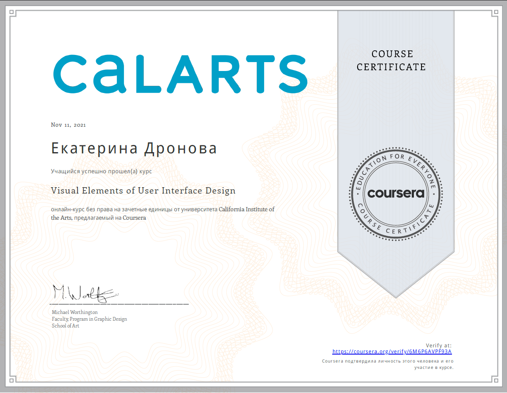

# Ekaterina Dronova

*Junior Frontend Developer*

---

#### Contacts

- *LinkedIn:* ekaterina-dronova
- *GitHub:* https://github.com/KateDronova
- *E-mail:* katedronova96@gmail.com
- *Telegram:* https://t.me/Feierin

---

#### About me

My goal and strong wish is to become a highly-qualified specialist and work in a reliable company.
All the previous year I have already devoted to studying, and now, finally, ***it's time to act***!

---

#### Skills and Proficiency:

1. Programming tools:
    - HTML;
    - CSS;
    - JavaScript;
    - TypeScript;
    - JEST;
    - Git & GitHub;
    - VS Code;
    - Markdown.
2. Design tools:
    - 2D: Adobe Photoshop, Illustrator, Coral Draw;
    - 3D: ArchiCAD, Sketch Up, КОМПАС-3D, Lumion.
3. Mapping tools:
    - MapInfo

---

#### Education & experience 

- Ulyanovsk State Technical University (bachelor designer - architect);
- Coursera: UX/UI online course;

- HTML-academy: HTML, CSS & JavaScript online theory and practice (6 months);
- Codecademy: free online lessons on JS;
- eLearn UpskillMe program on RS-school base: *in progress*.

---

#### Languages

- English - B2;
- Russian - native;
- French - basics;
- Spanish - basics;
- Turkish - basics.

*Ekaterina Dronova, 02/05/2023*
